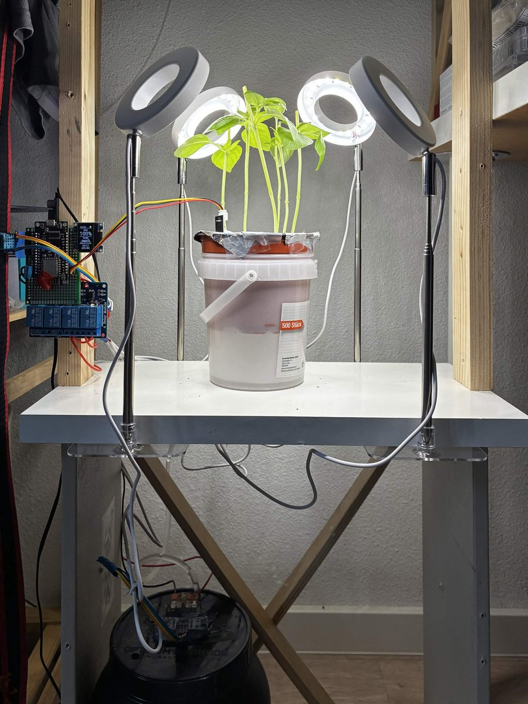
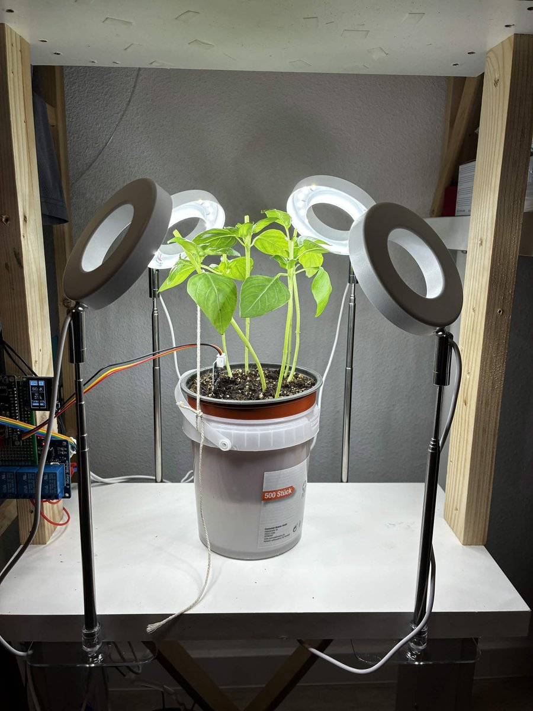

# 羅勒種植箱：ESP8266 上的閉迴路潮汐式灌溉系統

[English](README.md) · **繁體中文**

> [!WARNING]
> **自動澆水自 2026-09-20 起已暫停。** HC-SR04 已經讀不到值，而且只要接著它，
> 板子就開不了機。沒有水位讀值，泵浦浸沒下限（`pump_min_cm`）與排水故障檢查
> 兩者都是瞎的——這是兩道安全連鎖失效，不是無關痛癢的缺口。緩解方式是在
> Home Assistant 裡把 `Water below` 調到 10，完全不需要碰到裝置本體。
> 細節見[已知問題](#已知問題--待辦)。



*實際完工的裝置，攝於 2026-09-20。花盆周圍的鋁箔是防蕈蚋屏障，不是封死的蓋子——為什麼打孔之後還是有效，見下方[澆水邏輯](#澆水邏輯)一節。幼苗明顯徒長——莖細長、葉片稀疏泛白，這個症狀在下方「補光燈」一節有實測資料可以解釋。OLED 上的 `TANK -0.0%` 不是另一個獨立的謎團，現在已經查明：這張照片攝於 12:41，晚於水位感測器當天最後一次正常讀值的 10:46，而螢幕當下實際印出來的是 **`-nan%`**——在 18 px 字體下看起來非常像 `-0.0%`。詳見[已知問題](#已知問題--待辦)。*

室內種羅勒，完全沒有日照，靠底部淹灌澆水：泵浦把外槽淹滿，水再靠重力虹吸流回水箱，何時該啟動整個循環則由 ESP8266 直接讀取土壤狀態決定，而不是靠計時器。補光燈也有排程，但這個排程刻意**不**放在韌體裡——原因見下文。

這個專案裡最有意思的工程內容，最後其實不是澆水邏輯本身，而是要先讓裝置本身撐得夠久，才有機會跑完那個循環——見[穩定性的故事](#穩定性的故事裝置為什麼一直重開機)。

## 這是什麼

- 花盆放在外槽裡；外槽架在水箱上方。
- 單一顆泵浦把測量好的水量灌進外槽，然後直接關閉——外槽會透過同一根管子，以重力虹吸的方式流回水箱。
- 一顆電容式土壤感測器負責判斷植物是否需要澆水，以及一次淹灌/排水循環是否真的有效。水箱上的超音波感測器則量測水箱剩餘水量，同時兼作定量控制與缺水保護。
- 一顆 NodeMCU v3（ESP8266）跑完整套邏輯，並透過 ESPHome 原生 API 回報給 Home Assistant。Home Assistant 是唯一的使用者介面——目前部署的韌體上沒有本機網頁介面。

## 硬體

| 零件 | 型號 | 備註 |
|---|---|---|
| MCU | NodeMCU v3（Lolin），ESP8266EX | 首次燒錄走 USB（CH340），之後走 OTA |
| 土壤濕度 | HW-390 電容式探頭 v2.0 | 供電走 **3V3**，不可用 5V——見[接線與接腳](#接線與接腳) |
| 水箱液位 | HC-SR04 超音波 | 供電 5V，ECHO 加 1k/2k 分壓，盲區 2cm |
| 箱內環境 | DHT11 | 量的是箱內空氣，不是水箱頂部空間 |
| 顯示 | SSD1306 0.96" OLED，I2C 0x3C | 直立安裝（旋轉 90°） |
| 繼電器 | SRD-05VDC-SL-C，4 路板（用 2 路） | JD-VCC 跳線帽已拔除，另外獨立供電 |
| 泵浦 | 潛水式，2.5–6V，約 3W | 兩端跨接一顆 M7 二極體吸收反電動勢 |
| 轉換器 | 2 顆 LM2596S（可調）+ 1 顆 RY8326（固定 5V/3A） | 見[電源](#電源) |
| 水箱 | ON Gold Standard 900g 乳清蛋白桶 | 桶身 HDPE #2、蓋子 PP #05，實測有效截面積約 130 cm² |
| 外槽 | PP #05 容器 | 約 500 ml，放進花盆後實際可用水量約 200 ml |

完整的逐點接線說明，含通電前檢查清單，見 [`docs/WIRING.txt`](docs/WIRING.txt)（中英雙語，圖以等寬 ASCII 繪製）。附註：`docs/WIRING.txt` 裡引用的是單純用桶口半徑算出來的幾何截面積（約 143 cm²）；韌體實際用的是實測值（約 130 cm²，也就是水位每變動 1cm 約對應 130 ml），因為桶身往下會收窄，實測值才是真正對應「水位每變動一公分等於多少水量」的數字。

## 接線與接腳

這裡每一個 GPIO 的選擇都受限於 ESP8266 的開機 strapping 腳位——好幾個 GPIO 在 reset 當下必須維持特定電位，選錯不是開不了機，就是燒不進韌體。

```
  A0  土壤 (HW-390 AOUT，3V3 供電)
  D1  GPIO5   OLED SCL
  D2  GPIO4   OLED SDA                    (I2C 位址 0x3C)
  D3  GPIO0   繼電器 IN1 -> 補光燈          (開機時被拉高：決定開機模式)
  D4  GPIO2   HC-SR04 TRIG                (strapping 腳——USB 燒錄前
                                            必須先拔掉超音波感測器)
  D5  GPIO14  HC-SR04 ECHO，經 1k/2k 分壓
  D6  GPIO12  繼電器 IN2 -> 補水泵浦
  D7  GPIO13  DHT11 資料腳，10k 上拉到 3V3
  D0  GPIO16  空接 (候選：把 TRIG 搬來這裡——非 strapping 腳)
  D8  GPIO15  不可使用——開機時被拉低；接了 active-low 的周邊會讓
              板子開機自鎖
```

以下兩個接線事實特別值得強調，因為一旦接錯，燒壞的是硬體，而不只是行為異常：

- **HC-SR04 的 ECHO 一定要經過分壓。** ESP8266EX 的 GPIO 輸入絕對最大額定是 3.6V；HC-SR04 若用 5V 供電，沒分壓的話 ECHO 會直接把 5V 邏輯電位灌進腳位。這是整套系統裡唯一一個「省掉零件會直接永久燒壞硬體」的地方。只有兩種 ECHO 接法是安全的：5V 供電**搭配**分壓，或 3V3 供電**不加**分壓——而 5V 供電卻沒分壓的接法會一邊正常讀值、一邊慢慢燒壞腳位，所以讀值正常不代表接線正確。
- **繼電器的邏輯 VCC 必須接 3V3，不能接 5V。** 這種板子是光耦隔離的；用 3.3V 的 GPIO 去驅動 IN，若邏輯 VCC 是 5V，光耦在「高電位」時仍會漏約 0.5 mA 電流，繼電器就放不開。接 3V3 的話則是 2.1 mA（開）／0 mA（關），乾淨俐落。
- **`JD-VCC`（線圈電源）必須接常時通電的電源。** 如果它接到的是某個會被繼電器自己切斷的電源軌，這顆繼電器一旦打開就會切斷自己的線圈電源，永遠合不回去。

## 電源

三顆 DC-DC 轉換器都吃同一組 12V 電源，而且**全部常時通電**——繼電器切的是轉換器的「輸出」，不是 12V 輸入端。這個設計用一點點待機耗電（每顆約 0.1–0.3W）換來兩個好處：LED 環永遠不會碰到轉換器冷啟動時的電壓過衝，而且每一條電源軌都能在實際負載下量測、微調，不必用猜的。

| 轉換器 | 輸出 | 供電對象 | 實測 |
|---|---|---|---|
| LM2596S #1 | 4.45V（帶載調校） | 4 顆 LED 補光環，經繼電器 CH1 | 4 環合計 1.4A / 6.2W，約為標稱 60W 的一成 |
| LM2596S #2 | 5.00V | 補水泵浦，經繼電器 CH2 | 常態 0.6A，堵轉脈衝約 2A（僅數十毫秒） |
| RY8326 | 固定 5.0V / 3A | NodeMCU VIN、DHT11、HC-SR04、繼電器 JD-VCC | 約 0.5A，運作時溫度不高 |

泵浦馬達的反電動勢是真實存在的問題：泵浦兩端跨接一顆 M7 二極體（1A/1000V），色帶朝正極。因為這裡繼電器切的是轉換器「輸出」，接點是直接在切斷馬達電流——沒有這顆二極體，反電動勢脈衝會在繼電器接點上拉弧，每次循環都會讓接點多一點點點蝕。

## 澆水邏輯

整套邏輯是**閉迴路在土壤濕度上，而不是在澆水量上**。單次淹灌只會讓土壤探頭的讀值移動大約 5% 的量程，而超音波感測器約 0.3cm 的解析度，對上約 1.7–2.0cm 的單次澆水量，等於約 20% 的量測粒度——精確計量水量從一開始就不可能作為控制變數。所以邏輯改成：淹灌固定水量、放水排掉、等它往上滲透、讀一次探頭，還不夠濕就再來一次。

```
                    每 10 分鐘檢查一次：土壤 < 「Water below」？
                    水箱扣掉一次澆水量後還高於地板值？
                    沒有 drain fault？鎖定時間已過？
                              |
                              v
                    ,----------------------.
                    | 淹灌：泵浦開           |  每 2 秒量一次，停在：
                    | (最長 120 秒)          |   - 達到設定水量
                    `----------------------'    - 觸底 (6cm)
                              |                  - 20 秒沒有水位變化 ->
                              v                    重新引水，最多 3 次，
                    ,----------------------.       否則中止
                    | 排水：泵浦關，          |  重力虹吸回流，
                    | 等待 3 分鐘             |  實測約 80–90 秒
                    `----------------------'
                              |
                              v
                    ,----------------------.
                    | 靜置：等 10 分鐘，      |  底部澆水往上滲透很慢；
                    | 再讀土壤                |  馬上讀只會讀到表面的
                    `----------------------'    暫態，不是真實濕度
                              |
                    土壤 >= 「Stop at」？ --- 是 -> 完成
                              |
                              否，且循環次數 < 「Max cycles」(5)
                              |
                              `---> 再跑一輪
```

- **實際澆水量：** 設定值 1.8cm 實際會灌到約 1.9cm（約 247 ml），耗時約 34 秒——大約 6 秒用來把虹吸管裡的空氣排出，剩下約 28 秒才是真正在灌水。每 2 秒一次的輪詢，對上約 0.06–0.07 cm/s 的注水速率，代表這個迴圈在結構上就會超出設定值約 0.1–0.2cm；設定值變動小於約 0.3cm 基本上都落在這個雜訊範圍內。
- **重新引水（prime retry）。** 每次排水都是靠重力虹吸把送水管路裡的水排空，所以每次淹灌開始時，泵浦都得先把管路裡大約 70cm 高的空氣柱推出去，才能真正把水送上去。小型離心泵浦沒辦法穩定地自行對抗這段空氣柱完成引水。如果水箱液位 20 秒內完全沒有變化，泵浦就會關 3 秒——讓水回流灌滿泵殼——再重新啟動，最多重試三次，否則這次循環就以「乾轉」中止。
- **防蕈蚋措施之一：濕度門檻。** `Stop at` 從 70% 調到 55%，`Water below` 從 30% 調到 22%（2026-09-20）：土壤探頭位置偏表層，這兩個數字實質上是在指定「表層要維持多濕」——而表層那幾公分正是蕈蚋（*Sciaridae*）幼蟲的全部棲地。根系那一層無論如何都會因為底部澆水而維持飽和；只有表層被刻意調乾，而 4–5 天的乾旱期剛好可以打斷牠們 3–4 天一代的繁殖週期，而不只是拖慢牠。這個取捨在韌體的註解裡寫得很直白：如果植株真的開始萎蔫，就把門檻調回去——羅勒本身才是重點，蕈蚋只是討厭而已。

### 防蕈蚋措施之二：打孔鋁箔

| 裝設前 | 裝設後 |
|---|---|
|  |  |
| 土壤表層裸露 | 鋁箔屏障，2026-09-20 裝上 |

跟調整濕度門檻同一天，又加上了第二個、更直接的防治手段：土壤表面現在包了一層**打了孔的鋁箔**，不讓蕈蚋接觸到牠們產卵所需的濕潤裸土。這取代了原本用麵包／馬鈴薯片做的幼蟲誘捕陷阱。

一個直覺上很合理的質疑是：任何覆蓋物都會擋住蒸發，讓表層維持濕潤，讓貼近表層的探頭失真，於是 `Water below` 永遠不會再觸發。**但這個質疑撐不過「打孔」這件事。** 透過小孔的擴散速率跟孔的**半徑**成正比，而不是跟面積成正比——這是小孔擴散的標準結果：N 個孔的擴散通量正比於 N·r，開孔面積卻是 N·π·r²——所以很多細小的孔，蒸發效果遠比它們加起來那一點點開孔面積所暗示的要好得多。葉片本身就是這樣運作的：氣孔只占葉片面積約 1%，卻能通過約 50% 的開放水面蒸發量。這個推論是當初決定這樣做的理由，不是保證——它成立的前提是孔洞彼此分得夠開、各自獨立這個理想情況，下面那個驗證方式才是真正在這個花盆上拍板定案的依據，不是理論本身。

- **孔徑才是真正的設計限制，而且是為了擋蟲，不是為了擋水：** 孔徑要 ≤1mm（用大頭針或圖釘打孔）。到了 2mm 以上，成蟲直接就能走過去，屏障形同虛設。真正的弱點是莖穿出的開口——那些開口本來就必須夠大，任何一處沒貼緊，整張鋁箔的防護就破功，所以每一根莖都要把鋁箔摺緊、用膠帶貼牢。
- **附帶效果：** 鋁箔會把光反射回植株冠層，同時遮蔽表層讓藻類（蕈蚋的食物來源之一）長不起來。
- **免費、可證偽的驗證方式。** `sensor.basil_soil_voltage`／土壤濕度本來就會持續記錄，所以這個檢查完全不用額外成本：接下來幾天觀察它的走勢。如果它還是像包箔之前一樣會跌破 `Water below`（22%），代表蒸發量足夠，不用改動任何東西。如果它卡在 30% 左右不再往下掉，代表打孔密度不夠——該做的是多打幾個孔，而不是把鋁箔拆掉。
- **一個值得老實講出來的真實風險：** 鋁箔會導電，而繼電器板和 12V 電源軌就在花盆旁邊。之所以要把它固定牢，正是因為這一點——鬆脫的鋁箔片掉到接點上，在這套裝置裡是真實會發生的故障模式，不是紙上談兵。同樣的導電性，也要留意別碰到土壤探頭自己外露的接腳。

## 安全連鎖機制

以下每一項都不是可有可無的裝飾，各自對應一個在製作過程中實際觀察到、或經過推演確認的失效模式。

- **泵浦絕對地板值 (`pump_min_cm`，6cm)。** 在淹灌迴圈中每 2 秒檢查一次，不管澆水量進度到哪都會生效。潛水泵浦靠所抽送的水來散熱——乾轉幾秒就會壞掉，比 20 秒的無水流偵測還快。*（這個數值目前仍是估計值，尚未實測——見[已知問題](#已知問題--待辦)。）*
- **獨立的泵浦看門狗。** 對補水泵浦設一個 130 秒的硬性上限，而且是用可以中途取消的 `script` 寫的，不是內嵌的 `delay:`——ESPHome 沒辦法取消內嵌的 delay，早期版本因此會在**第一次**泵浦啟動後 130 秒觸發，完全不管中間有沒有因為重新引水而關了又開，這樣可能會把一次正常的重新引水攔腰砍斷。
- **排水異常鎖定——以及它實際的解除方式，比第一眼看起來要細膩一些。** 如果排水結束時，超過一次澆水量的 40% 沒有回到水箱，`drain_fault` 會鎖定為 `on`，並接管 OLED 顯示。每 10 分鐘一次的自動觸發會檢查這個鎖定狀態，鎖定中就不會啟動新的循環——但手動按下的 `button.basil_water_now`（「Water now」）**不會**檢查這個狀態，還是會直接跑一次循環。這一點很關鍵，因為 `drain_fault` 是在**每一次** `water_cycle` 執行結束時重新計算的，不管是被哪個觸發器啟動的：如果那次循環最後水真的有流回來，鎖定就會自動解除；如果那次循環是以「乾轉」中止收場（或者水箱本來就不夠水，連一次循環都沒真的跑），鎖定狀態則完全維持原樣不變。`button.basil_clear_drain_fault` 則是唯一一個完全不用跑水、直接把鎖定解除的方式。
- **水箱見底保護。** `tank_cm < pump_min_cm` 會觸發 `binary_sensor.basil_tank_empty`，任何循環都無法在這個狀態下啟動；Home Assistant 的告警會延遲 5 分鐘才通知，用來過濾掉淹灌過程中正常的短暫水位下降。
- **最大循環次數上限（5）。** 接觸不良的電容式探頭會誤讀成乾燥（種植過程中真的遇過：疏苗後探頭周圍出現空氣間隙，即使土壤已經飽和，讀值仍卡在 50–51%，直到把土重新壓實在探頭周圍為止）。沒有這個上限，一個說謊的探頭會讓外槽無止盡地被淹灌。
- **結構性、而非軟體性的排水 fail-safe。** 水箱的位置**低於**外槽。不論什麼原因讓泵浦停止——包括斷電——重力都會自動把外槽的水排回水箱；沒有排水泵浦或 H 橋這種可能往錯誤方向失效的元件。唯一這套結構擋不住的情況是繼電器接點燒黏，因此外槽另外設計了**強制溢流孔**通回水箱，尺寸是按水箱容量大約是外槽十倍這件事（水箱約 2.3 L，外槽實際可用約 200 ml）抓的。

## 補光燈：排程為何留在 Home Assistant 而不是韌體

韌體在定案之前經過三個設計版本，每一次失敗都提供了有用的資訊：

1. **韌體內的定時觸發**（固定時間開、固定時間關），繼電器的還原模式設成 `RESTORE_DEFAULT_OFF`。白天重開機或做 OTA 更新時，繼電器會還原成「關」，燈就一路黑到下一個排程的開燈時間點。
2. **韌體內的 60 秒重新套用迴圈。** 修好了重開機的問題——做法是每分鐘重新套用一次排程狀態——但這也代表使用者在就寢前手動關燈，會在 60 秒內被悄悄改回去。對「自主性」而言是對的，對「跟這東西一起生活」而言是錯的。
3. **改由 Home Assistant 掌管排程。** 現在韌體裡完全沒有補光排程——繼電器就只是一個 `switch` 實體。Home Assistant 的 `automation.basil_grow_light_schedule` 由兩個時間觸發器加上一個 `homeassistant: start` 復原用觸發器組成（原本還有一個「裝置恢復連線」的觸發器已經移除——後來發現 `esp8266: restore_from_flash: true` 本來就會讓繼電器狀態跨重開機保留，所以那個觸發器其實是在平常 3 秒等級的 API 短暫斷線時被誤觸發，發出不必要的開關指令）。現在手動覆寫的狀態會一直維持到下一個排程時間點，因為中間完全沒有東西會重新套用排程。

目前排程：**07:30–00:30 開燈（17 小時）、00:30–07:30 關燈（7 小時）**——從原本 18 小時的設計值調整過來，配合房間的作息。原本 18 小時的設計值仍值得留下來作為光量預算的參考：四顆補光環在控制器最亮設定下實測為每顆 4.45V / 0.35A = 1.56W，四顆合計 6.2W——約為標稱 60W 的一成——換算下來大約是 187 µmol/m²/s，在 18 小時光照下每日光積分（DLI）約 12.1 mol/m²/day——換算到目前實際的 17 小時排程，大約是 11.4 mol/m²/day——落在羅勒常見 12–16 DLI 目標區間的**下緣、甚至略低於下緣**，而且這個估計還偏樂觀，因為它假設每一顆光子都落在花盆上。**這裡最關鍵的其實是安裝高度**：PPFD 會以距離平方反比衰減，所以補光環必須貼近植株冠層——大約高出冠層 10cm——本文開頭的照片就示範了沒維持這個距離的後果：莖節拉得又長又蒼白，一路朝光源伸長，而不是長得緊實。

## Home Assistant 整合

裝置透過 ESPHome 原生 API 對外開放（`Noise_NNpsk0_25519_ChaChaPoly_SHA256` 加密，金鑰放在 `secrets.yaml`），連到一台跑 Home Assistant 的樹莓派 4。它沒有本機網頁介面，也沒有 MQTT——HA 是刻意設計成唯一的介面（`basil.yaml` 裡有一段註解解釋為什麼移除了 `web_server:`：ESP8266 能同時服務的連線數非常有限，瀏覽器若開著網頁介面的 SSE 串流，會直接跟 HA 的 API 連線搶同一個有限的名額）。

| 類別 | 用途 |
|---|---|
| `sensor` | 土壤濕度 %、土壤電壓（診斷用）、水箱 %、水箱深度、水箱距離（診斷用）、箱內溫度、箱內濕度、WiFi 訊號、運作時間 |
| `binary_sensor` | 需要澆水、水箱見底、排水異常 |
| `switch` | 補光燈（補水泵浦刻意**不**對外開放——一個沒有計時保護的泵浦開關，被放進別人的自動化裡是個風險） |
| `number` | Dose（澆水量，cm）、Max cycles（最大循環數）、Stop at（停止門檻 %）、Water below（觸發門檻 %）、Lockout（鎖定時間，小時） |
| `button` | Water now（立即澆水）、Calibrate: start fill（校正：開始注水）、Calibrate: save dose（校正：儲存澆水量）、Clear drain fault（解除排水異常） |

三個告警自動化，狀態變化時會發通知：

- **排水異常**——鎖定當下立即通知，並附上解除異常按鈕的連結。
- **水箱見底**——延遲 5 分鐘，過濾掉淹灌過程中正常的短暫水位下降。
- **裝置離線**——`sensor.basil_uptime` 變成 `unavailable` 超過 30 分鐘才通知，這個長度足以撐過 HA 重啟或一般的 WiFi 短暫抖動，不會為了沒事而吵醒任何人。

## OLED

128×64 的 SSD1306，實體上側躺安裝，以 64 寬、128 高的直立畫布驅動。畫面分三種：待機、執行中（顯示目前階段——`FILL`、`DRAIN`、`SOAK`、`PRIME`——以及目前是第幾次循環）、以及排水異常（全螢幕，不管燈是開是關都會接管畫面）。只要補光燈是關的，螢幕就會跟著暗下來，但有兩個刻意保留的例外：異常鎖定中，或循環執行中，這兩種狀態螢幕一定會亮著——因為畫面全黑絕對不能藏住一個需要人來處理的狀況。

更新頻率是 500ms，以前是 250ms，用來驅動一個每秒兩次的全螢幕反白提示。這個反白效果後來被拿掉了：SSD1306 全點亮時電流約 25–30 mA，相對純文字約 6 mA，而以 2Hz 切換這樣的負載，會讓 3.3V 電源軌被拉得夠明顯，進而在 ADC 上看到雜訊、超音波讀值跳動——很可能是一次淹灌過程中觀察到的 API 斷線的成因之一。現在的提示效果改成一個固定的 2px 外框加一小塊反白徽章，電流波動小得多。

## 穩定性的故事：裝置為什麼一直重開機

這是整個專案裡最值得細看的部分，也值得把「已經確認的事」和「被排除的假設」講清楚。

**症狀。** ESP8266 每小時會集中重開機好幾次，每次爆發之間有 86–113 分鐘的正常運作時間。從 API 客戶端的角度看，故障的樣子是 `SocketClosedAPIError`、`EncryptionHelloAPIError`、`HandshakeAPIError`、`TimeoutAPIError`。

**真正關鍵的判別依據：** ping 全程都在 1–2 ms 內正常回應，即使每一次 API 握手都失敗。這台裝置的 ICMP 回應是由 SDK/lwIP 網路堆疊處理的，不是走 Arduino 主迴圈——所以「裝置對 ping 有反應」完全不能證明它還能服務任何連線。正是這一點，讓除錯方向沒有滑向「裝置明明在線，所以不可能是韌體的問題」這個直覺陷阱。

有三個看似合理的成因先後被提出，也先後被實測推翻：

| 假設 | 為什麼看起來合理 | 被什麼推翻 |
|---|---|---|
| HA 佔用了唯一的 API 名額，這本身就不穩定 | 每次故障當下 Home Assistant 都連著 | 實測有兩段乾淨的運作紀錄，分別 86.7 分鐘和 112.7 分鐘，HA 全程連線且**閒置** |
| 連線抖動（重連、串流日誌）把裝置搞當機 | 每次重開機都跟「有人正在做某件事」同時發生 | 這只是混雜相關，不是因果——燒錄、澆水測試、DEBUG 日誌串流都剛好在同一段時間發生 |
| 負載造成電壓下陷（泵浦／LED 瞬間啟動） | 教科書等級的 brownout 症狀 | 實測 5V 輸入端 5.23V，**3V3 為 3.29V**，LED 環負載下 4.42V——長期性的下陷會量到 3.0V 以下。（WiFi 傳輸瞬間的微秒級暫態並未被排除——三用電表量不到那麼快——但穩態 3.29V 已經沒剩多少餘裕讓它真的造成影響。） |

原本規劃的大電容改機方案（3V3 上並聯 470µF + 0.1µF）在這些量測結果出來後就**暫緩**了——它的整個前提是一個實測資料並不支持的電壓問題。

**記憶體一開始被懷疑，但證據最後指向相反的結論。** 這個論證最乾淨的形式只需要兩個數字：連續 27 分鐘的例行取樣中，裝置的可用記憶體一直停在 **4.0–4.7 kB**，沒有下降趨勢；接著它當機時，剩餘的可用記憶體反而**比那整段時間都還多**——**6.8 kB**。如果機制真的是記憶體耗盡，當機應該發生在那段低點裡，而不是比它還高的地方。

把下面那個 `captive_portal` 修復一併放進視野，同一個結論會從另一側再成立一次：切掉之後裝置的可用記憶體穩定在 **6.2–6.9 kB**，並在那個水位**連續運作了 12.8 小時**。6816 B 這次當機正落在那個區間之內——它是在一個裝置早已證明自己能撐住半天的記憶體水位上當掉的。

原始筆記引用的那行 recorder 記錄本身值得補一個但書，因為它自成一課：

```
00:14:11  free=12000  block= 2992  frag=43%   剛開機
00:14:30  free= 7152  block=11632  frag= 4%
00:15:00  free= 6872  block= 3408  frag=44%
00:16:20  free= 6816  block=11600  frag= 4%   <- 被引用的就是這筆
```

`block` 是最大的連續可用區塊，因此**不可能大於** `free`。後兩欄並不屬於同一筆 `free` 讀值。這支 watcher join 了三個各自獨立更新的 Home Assistant 感測器，並且刻意讓每個感測器從自己的最後已知值補齊，而不是等待一個同步刻度——因為更早的版本曾經因為苦等一個已經超過一小時沒變動的感測器，靜靜地什麼都沒收集，整整 45 分鐘。這個取捨的代價就顯示在這裡：`block=11600 / frag=4%` 是剛開機時量到的，當下 free 確實在 12 kB 附近，等它傳上來時，free 早已隨著 Home Assistant 重新連上而掉到 6.8 kB。

所以真實讀值對這個結論其實是**更有利**的，而不是更不利——量到那塊區塊的當下，堆積記憶體幾乎是完全連續的。但這份記錄的任何單一行，都混合了不同瞬間擷取的數值，不該被當成某一瞬間的完整狀態引用。

**真正的成因，有直接的因果證據支持：** 已經有一個 API 客戶端連線時，第二個客戶端嘗試進行 Noise 握手，會直接讓裝置當機。`reset_reason` 顯示為 `Exception`——這是 ESP8266 的韌體例外，不是看門狗咬到，也不是斷電重啟。最清楚的一筆資料：連續 23 小時、878 行日誌，零次例外重開機；接著刻意接上第二個客戶端——3 分鐘內連續發生 3 次例外重開機，每一次都發生在一次失敗的握手嘗試之後 20–60 秒。停掉第二個客戶端，重開機也跟著停止。

**由此得出的操作規則：** 任何時候只能有一個 API 客戶端連線。這個名額由 Home Assistant 佔用。這裡還有一個容易漏掉、卻很花時間的細節——**光是停掉另一個客戶端還不夠。** 裝置會把已經斷線的連線的「自己那一半」繼續留著，直到自己的 keepalive 逾時為止；在這段空窗期內連進去，一樣算是第二個客戶端，一樣會讓裝置當機——這一點已經被一次重開機證實：某個腳本在對方的 socket 早已關閉三分鐘後才連上，結果裝置照樣當機。

**最後上線的修法：** 移除 `captive_portal:`（它會額外拉進一個網頁伺服器和一個 DNS 伺服器，但實際上都用不到），釋放出 2008 B 的靜態記憶體（48900 → 46892 B）和 40922 B 的 flash 空間。之後裝置在只有 HA 這一個客戶端的情況下連續跑了 **12.8 小時**——這是後續一切比較的對照組。

**值得單獨記一筆的數字：** 為了找出上面這一切而加上的診斷功能——堆積感測器、重開機原因回報——本身就多耗掉約 655 B，佔總記憶體約 0.8%。在一台只剩 3–4 kB 可用記憶體的裝置上，這等於一口氣吃掉剩餘餘裕的五分之一。量測那條邊界，本身就把那條邊界往前推了。

**另一個教訓，來自負責記錄這一切的觀測程式本身，跟裝置無關。** 它原本設定成服務管理程式「永遠重啟」的模式，跑的又是一支有明確截止時間的腳本。一旦超過那個截止時間，腳本會乾淨地結束，服務管理程式把它重新啟動，它一看截止時間早就過了，又立刻結束——每隔幾秒鐘一次，沒完沒了，一個包裝成「健康服務」外表的重啟迴圈。後來改成「只有失敗才重啟」解決了這個問題。這裡的通則是：「永遠重啟」這種策略，應該用在設計上就要一直跑下去的服務，不該用在有明確終點的工作上。

## 已知問題 / 待辦

> [!WARNING]
> **進行中的故障，2026-09-20：HC-SR04 讀不到值，而且只要接著它，板子就開不了
> 機。** 在這件事解決之前，自動澆水必須保持關閉——沒有水位，`pump_min_cm` 與
> 排水故障檢查都是瞎的。

**韌體已被排除——靠的是時間線，不是論證。** 這點值得明講，因為第一直覺是最近
改的韌體把它弄壞了，而那個直覺是錯的。目前這版是 00:58 燒錄的，感測器在那之後
**持續穩定讀出 7.82–7.85 cm，一路到 10:24**，也就是 9.5 小時。它是在一段實體
作業的過程中失去回應的，**10:46:02** 給出最後一次正常讀值，之後就再也沒有輸出，
而裝置本身仍然活著（13:39 時已開機 2.9 小時）。硬體介入的前後是同一個 binary，
所以那些修改不可能是原因。跑在 Pi 上的記錄器用一次查詢就解決了這件事，否則這會
是一個下午的韌體二分搜尋。

**工作假說——尚未確認：模組本身以某種會拉載 TRIG 的方式故障了。** 這一個故障
就能同時解釋兩個症狀。模組若在 TRIG 上漏電流，會在重置時把 GPIO2 壓在低電位，
於是 D4/GPIO2 那個早有記載的「邊緣、但通常開得起來」的 strapping 風險，就變成
了穩定重現的開機失敗；而一顆壞掉的模組在開機後熱插拔時，本來也就不會回 echo。
夠精簡，但未經測試——它是假說，不是診斷。

三個量測可以把它定案，由便宜到貴：

1. 斷電，在模組仍接著的狀態下量 D4/GPIO2 對 GND。健康的 HC-SR04 TRIG 輸入是
   高阻抗，>100 kΩ；只有幾 kΩ 就代表模組在拉它。
2. 運轉中量模組的 VCC 對 GND，預期 5 V。
3. 換一顆確定正常的 HC-SR04。這既是最快的測試，如果假說成立，也就是修復本身。

其中兩個嫌疑犯已經被排除。ECHO 的 1k/2k 分壓是 **SMD 0805 焊死**的，不是飛線，
所以「分壓線被扯掉」這條不成立；嫌疑範圍縮小到模組本身、它的杜邦接頭，或那三條
線。另外，鋁箔**並沒有**碰到 HC-SR04 附近的任何東西。

### 螢幕印出來的其實是 `-nan%`，而它連過三道防線

上方照片裡的 `TANK -0.0%` 從來就不是顯示錯誤，也不是舊值。`sensor.basil_tank`
自 10:47:20 起一直是 `unknown`，Home Assistant 會把 NaN 狀態呈現為 `unknown`，
而 OLED 當下印出來的是 `-nan%`——在 18 px 字體下看起來就是個很有說服力的 `-0.0%`。

NaN 一連穿過三道防線，而且每一道失守的原因都不一樣：

| 防線 | 為什麼擋不住 NaN |
|---|---|
| `has_state()` | NaN 狀態**也是**一個已發布的狀態。通過。 |
| `clamp {min: 0, max: 100}` | 與 NaN 的任何比較都為假，所以上下界都咬不到。通過。 |
| `printf("%.0f")` | 直接印成 `-nan`。 |

那個 clamp 確實存在，也確實什麼都沒擋到。顯示端的判斷式現已改為
`has_state() && !std::isnan(state)`，TANK 區塊也補上了它原本沒有的 `--`
else 分支——在此之前，水位一旦失效就什麼都不畫，看起來像螢幕壞了，而不是像
感測器壞了。設定檔驗證通過，但還沒燒錄。

### 目前這台裝置是安全的，但靠的是意外，不是設計

這一段值得明講，因為它正是那種會被後來某個出於好意的「修一下 NaN 處理」
變成 fail-open 的東西。

每一道泵浦閘門都是對 `tank_cm` 做比較——循環前的檢查
（`(tank_cm - dose_cm) > pump_min_cm`）與循環中的下限（`tank_cm > pump_min_cm`）。
**而與 NaN 的任何比較都為假**，所以這兩道閘門永遠過不了：循環不會啟動，正在跑
的也無法繼續。感測器死掉的狀態下，泵浦**根本不可能**運轉。

同一套語意也悄悄讓「水箱見底」警報失效，那是同一件事的鏡像：目前完全沒有水位
保護，有的只是「什麼都不會發生」。安全，但安全的理由沒有任何人設計過。

**還有一個後果，發生在另一個感測器上。** 鋁箔確實碰到了**電容式土壤探頭**。
這不會造成任何損壞，但一片導電板貼著電容式感測器，會耦合進感測電極、把讀值
往「濕」的方向抬高。在那個狀態下取得的任何土壤百分比都不可用。要注意它讓什麼
失效、又沒讓什麼失效：它讓那次**量測的條件**失效，而不是讓上面記錄的校正值失效。

如果反正都要拆線換模組，那就是順手採用 YAML 裡早已記載的乾淨修法的時機：
**把 TRIG 從 D4/GPIO2 移到 D0/GPIO16。** 那個 strapping 風險本來是被接受的設計
妥協，現在它咬人了。


這個裝置還沒有「完工」。以下把已經確定的事，和還沒確定的事分開列：

- **已確定：** 重開機爆發的根本原因（第二個 API 客戶端讓 ESP8266 的 Noise 握手當機），以及上面提到的操作面與程式碼修正。
- **待查：** ESPHome 2025.7.5 在 ESP8266 上的 API 元件，為什麼會在第二次握手時直接例外，而不是單純拒絕連線。值得在升級到較新版 ESPHome 之後重新確認，先不要假設這在目前版本上無法修。
- **待查：** 目前為止還沒有捕捉到任何一次「自發性」的 `reset_reason`——已記錄的每一次重開機都是燒錄、OTA，或刻意接上第二個客戶端所引發。下一次非預期的重開機，才是能判斷這個成因是徹底解決還是仍會復發的關鍵證據。
- **待查：** 修復後的 `max_block`（3176 B）究竟是舒服地高於 Noise 握手實際需要的門檻，還是只是剛好過關而已。這件事沒辦法在不刻意重現當機的情況下實際測試。
- **尚未實測：** `pump_min_cm`（目前是 6，屬於猜測值）——預定做法是把泵浦立在水箱底部，加水到它能不發出咕嚕聲順利起虹吸為止，量出那個深度，再往上加 1cm 當地板值。
- **尚未建置：** 外槽到水箱的溢流孔。就結構而言，這是唯一能擋住繼電器接點燒黏的保護，而外槽的容量大約只有水箱的十分之一——而且這件事在正常運作下也有影響，不只是故障情境：外槽扣掉花盆之後可用的空間（約 200 ml）本來就已經很接近一次正常澆水量（約 247 ml）。在溢流孔蓋好之前，下方兩顆校正按鈕的風險更明顯：它們本身沒有依澆水量停止的機制，只靠 130 秒的泵浦看門狗頂著，如果沒人盯著，一次校正就可能把將近一公升的水灌進外槽。
- **原因不明：** 上方主圖 OLED 上顯示的 `TANK -0.0%`。水箱百分比這個感測器在韌體裡是被限制在 0–100 範圍內的，所以實機上出現負值顯示，目前還沒有追出原因——這裡選擇如實記錄，而不是憑空猜一個解釋。
- **尚未在實際運作中觀察到：** 目前 Home Assistant 補光排程完整的「dawn（天亮）」半週期（dusk／關燈那一半已經驗證過；截至最後一次記錄時，dawn 那一半尚未觸發過）。
- **尚未檢查：** 防蕈蚋用的乾旱期（澆水之間刻意把土壤拉到 22%）會不會影響「下一次」循環的行為。乾透的花盆重新淹灌時，合理推測會吸收比本文澆水量數字所依據的 ~247 ml 基準更多的水，而這正是有可能牽動排水異常判定門檻的那種變化。目前雙向都還沒有實測資料。

## 建置 / 燒錄 / OTA

```sh
cp secrets.yaml.example secrets.yaml
# 編輯 secrets.yaml：至少要填 wifi_ssid / wifi_password。
# 另外三個欄位可以直接沿用範例值，也可以自己重新產生——
# 這份設定刻意沒有設定 OTA 密碼（原因見 basil.yaml 裡的註解），
# API 金鑰則是 ESPHome 可以幫你產生的 base64 Noise PSK。

esphome run basil.yaml --device COM15      # 第一次燒錄，走 USB
esphome run basil.yaml --device basil.local  # 之後的更新，走 OTA
```

一定要明確帶上 `--device`——單純執行 `esphome run` 會互動式詢問主機位址，在非互動環境下遇到 EOF 就會直接死掉。

這台裝置刻意不設 OTA 密碼：這裡做的取捨是，弄丟原始碼樹（連帶弄丟密碼）的機率，判斷起來比「LAN 上有人惡意推送韌體」更高。沒有密碼時的復原方式就是打開機殼、走 USB 重新燒錄。

**走 OTA 一樣要遵守上面那條「只能有一個 API 客戶端」的規則，而且這個時序值得寫清楚**，因為時機抓錯，賠掉的是一次 OTA，不只是一次連線重試而已：先擋住 Home Assistant 對裝置的連線，等它那一側的 socket 清乾淨（約 80 秒），再多等約 2 分鐘，讓裝置自己對那條已斷線連線的 keepalive 逾時，才開始上傳——在第二段空窗期內連進去，一樣算是第二個客戶端，可能會讓裝置在上傳過程中重開機。照這個順序做，一次真正的上傳只花了 **18.34 秒，乾淨俐落，一次就成功**——相對於前一晚 HA 還連著時的兩次失敗（分別卡在 61% 和 16%）。上傳完馬上解除你設的那個阻擋，動手前也先確認一下下一個補光排程的時間點，因為 Home Assistant 在被擋的這段時間裡是完全拿不到繼電器控制權的。

把這個「約 2 分鐘」當成目前實測有效的最短等待時間，不要當成有保證的安全門檻：這個專案裡另一筆測量記錄到，客戶端在對方 socket 清空整整三分鐘後連進去，裝置照樣重開機。這兩筆資料對「安全線到底在哪裡」並沒有完全一致的答案——拿不準的時候，寧可等得比 2 分鐘更久。

`basil-bench.yaml` 是另一份已被取代、但保留作參考的 build：只有感測器和一個本機網頁介面，沒有繼電器、沒有泵浦、沒有 WiFi——在正式機台還沒組好之前，用來在工作台上讀出校正數值。它的接線方式不一樣（見檔案開頭的註解區塊），不應該燒進已部署的正式裝置。

## 檔案結構

```
basil.yaml              正式部署的韌體 (ESPHome)
basil-bench.yaml         已被取代的工作台測試 build——僅感測器，本機網頁介面
secrets.yaml.example     secrets.yaml 的範本 (已加入 gitignore)
docs/WIRING.txt          完整接線圖 + 通電前檢查清單
docs/img/                本 README 引用的照片
serial-monitor.ps1       USB 燒錄除錯用的原始序列埠監看工具
set-numbers.py           透過 API 直接設定 `number` 實體（繞過 HA）
trigger-water.py         按下「Water now」並即時串流裝置日誌
watch-water.py           功能相同，但斷線會自動重連——用來在 API
                         重開機的情況下，仍能完整捕捉一次澆水循環
```

這三支 Python 腳本都會各自開一條到裝置的 API 連線。根據[穩定性的故事](#穩定性的故事裝置為什麼一直重開機)，只要 Home Assistant 已經連著，這些腳本就會變成第二個客戶端——後果不是腳本連線失敗而已，是裝置直接當機。執行任何一支之前，都要先把那個連線名額空出來（停掉或擋住 HA 的連線），而且要等裝置自己的 keepalive 逾時，不能只看 HA 那邊的 socket 關掉就以為沒事了。

## 授權

MIT——見 [LICENSE](LICENSE)。
